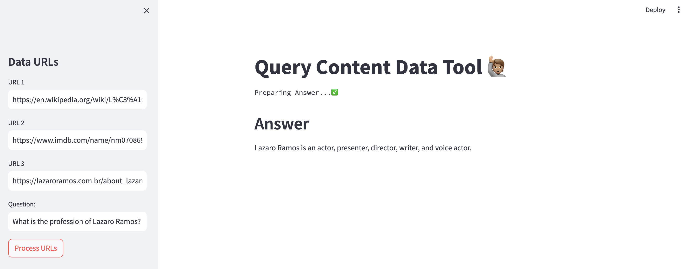

### Project using LangChain and Streamlit to scrape URL data and answer questions about the content

[Reference Youtube Video]( https://www.youtube.com/watch?v=MoqgmWV1fm8)



Install dependencies:
```bash
python3 -m venv venv
source venv/bin/activate
pip install -r requirements.txt
```

Run the Streamlit UI app:
```commandline
streamlit run main.py
```
